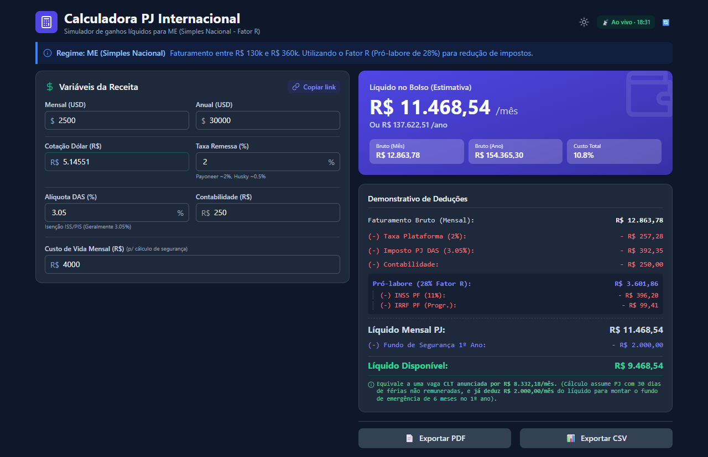
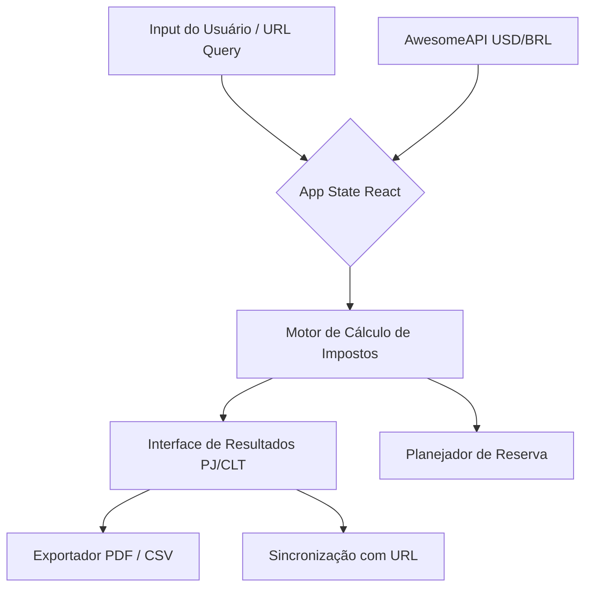

# Calculadora PJ Internacional

[](https://github.com/victormends/calculadora-pj-internacional/actions/workflows/ci.yml)
[](https://github.com/victormends/calculadora-pj-internacional/actions/workflows/deploy.yml)
[](https://opensource.org/licenses/MIT)

Uma calculadora simples e direta para desenvolvedores brasileiros que trabalham como Pessoa Jurídica (PJ) para o exterior. Calcula impostos (DAS, IRRF, INSS) e taxas (remessa, contabilidade) a partir de um salário em Dólar (USD).

🌐 **[Acessar a Calculadora Online](https://victormends.github.io/calculadora-pj-internacional/)**

<!-- Adicione sua imagem de screenshot dentro da pasta docs e descomente a linha abaixo -->


## ✨ Features Principais

- **Cotação em Tempo Real:** Obtém o valor do Dólar ao vivo via [AwesomeAPI](https://docs.awesomeapi.com.br/api-de-moedas) para garantir precisão no cálculo.
- **Comparação de Cenários:** Exibe o salário líquido categorizando a empresa em MEI, ME, EPP ou OUT (Lucro Presumido/Real) para fácil comparação.
- **Planejador de Reserva:** Conta com uma aba dedicada para calcular e planejar sua reserva de emergência baseada nos seus custos.
- **Exportação de Dados:** Permite baixar a simulação final em **PDF** ou **CSV** para controle financeiro.
- **Dark Mode:** Suporte nativo a tema escuro (TailwindCSS), adaptando-se às preferências do sistema operacional.
- **Compartilhamento (Stateful URL):** Salva o estado da simulação diretamente na URL.

## 🔗 Compartilhamento via URL

A calculadora hidrata automaticamente todos os campos a partir da query string, permitindo que você salve simulações ou compartilhe com outros devs. Parâmetros aceitos:

- `usd`: Salário em USD (ex: 5000)
- `rate`: Taxa de câmbio (ex: 5.25)
- `fee`: Taxa de remessa em % (ex: 1.2)
- `das`: Alíquota do Simples/DAS em % (ex: 6.0)
- `acc`: Custo mensal da contabilidade (ex: 200)

**Exemplo:** `?usd=5000&rate=5.50&fee=1&das=6&acc=300`

## 🏗️ Arquitetura e Fluxo de Dados

A aplicação foi construída para rodar totalmente no lado do cliente (Client-Side), sem armazenamento de dados sensíveis em banco de dados.



## 🛠️ Stack

- **React + TypeScript:** Base tipada e reativa.
- **Vite:** Bundler ultrarrápido para desenvolvimento.
- **Tailwind CSS:** Estilização utilitária ágil.
- **Vitest + Happy DOM:** Testes unitários focados em lógica e renderização.
- **jsPDF + jsPDF-AutoTable:** Geração de relatórios PDF locais.

## 🚀 Setup Local

```bash
# Instalar dependências
npm install

# Rodar os testes
npm test

# Executar em modo de desenvolvimento
npm run dev

# Fazer o build de produção
npm run build
```

## ⚠️ Aviso Legal (Disclaimer)

Esta é uma ferramenta de estimativa criada de desenvolvedor para desenvolvedor. Embora a lógica de cálculo procure seguir a legislação tributária brasileira vigente (como alíquotas do Simples Nacional, Anexo III, Fator R, etc.), **ela não substitui a orientação de um contador profissional**. As regras fiscais podem variar conforme a sua cidade, natureza jurídica (CNAE) e faturamento acumulado. Consulte sempre sua contabilidade antes de tomar decisões financeiras.

## 📄 Licença

[MIT](LICENSE) © 2026 João Victor Mendes
